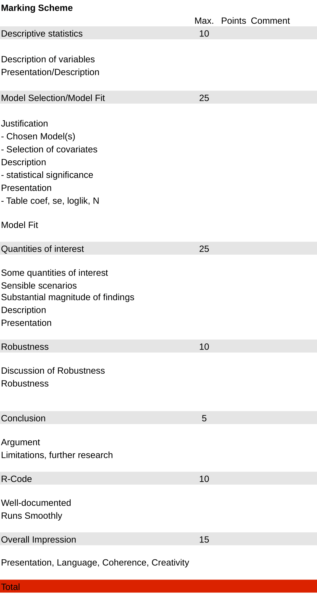

---

Today:

1.  Generalized Linear Models and Statistical Simulation
2.  Simulation, Simulation... Visualizing Interaction Effects in non-linear models
3.  Robustness checks
4.  Formatting and RMarkdown (Revision)

Goals for Today:

-   do simulations with non-linear & interactions over the range of values
-   think critically about the quantities of interest we produce
-   explore the commonly used robustness checks
-   review how to do citations and use chunk options in RMarkdown

---
```{r setup, message=FALSE, warning=FALSE, results='hide'}
# The first line sets an option for the final document that can be produced from
# the .Rmd file. Don't worry about it.
knitr::opts_chunk$set(echo = TRUE,
                      collapse = TRUE,
                      out.width="\\textwidth", # for larger figures 
                      attr.output = 'style="max-height: 200px"',
                      tidy = 'styler' # styles the code in the output
                      )

# The next bit is quite powerful and useful. 
# First you define which packages you need for your analysis and assign it to 
# the p_needed object. 
p_needed <-
  c("ggplot2", "viridis", "MASS", "optimx", "scales", "foreign", 
    "patchwork", "stargazer", "janitor")

# Now you check which packages are already installed on your computer.
# The function installed.packages() returns a vector with all the installed 
# packages.
packages <- rownames(installed.packages())
# Then you check which of the packages you need are not installed on your 
# computer yet. Essentially you compare the vector p_needed with the vector
# packages. The result of this comparison is assigned to p_to_install.
p_to_install <- p_needed[!(p_needed %in% packages)]
# If at least one element is in p_to_install you then install those missing
# packages.
if (length(p_to_install) > 0) {
  install.packages(p_to_install, repos = "http://cran.us.r-project.org")
}
# installation from a different source
if ("countreg" %in% p_to_install) {
  install.packages("countreg", repos = "http://R-Forge.R-project.org")
}
# Now that all packages are installed on the computer, you can load them for
# this project. Additionally the expression returns whether the packages were
# successfully loaded.
sapply(p_needed, require, character.only = TRUE)

# This is an option for stargazer tables
# It automatically adapts the output to html or latex,
# depending on whether we want a html or pdf file
stargazer_opt <- ifelse(knitr::is_latex_output(), "latex", "html")

# Don't worry about this part: it ensures that if the file is knitted to html,
# significance notes are depicted correctly
if (stargazer_opt == "html"){
  fargs <- formals(stargazer)
  fargs$notes.append = FALSE
  fargs$notes = c("<em>&#42;p&lt;0.1;&#42;&#42;p&lt;0.05;&#42;&#42;&#42;p&lt;0.01</em>")
  formals(stargazer) <- fargs
}

# only relevant for ggplot2 plotting
# setting a global ggplot theme for the entire document to avoid 
# setting this individually for each plot 
theme_set(theme_classic() + # start with classic theme 
  theme(
    plot.background = element_blank(),# remove all background 
    plot.title.position = "plot", # move the plot title start slightly 
    legend.position = "bottom" # by default, put legend on the bottom
  ))

set.seed(2024)
```


# The Relationship Between Generalized Linear Models and Statistical Simulation

We have worked with different GLMs in the second part of the course and as a review, you can find all the main information about them in the table below.

A model that is part of the generalized linear model family is defined by (i) a stochastic component, (ii) a systematic component, and (iii) a link function. As you can see, the models merely differ by their *stochastic components* and *link functions*.


+-------------------+-----------------------------------+-----------------------+-------------------------------------+-----------------------------------------------------+
| Model             | Stochastic Component              | Systematic Component: | Systematic Component:               | Inverse Link Function                               |
|                   |                                   |                       |                                     |                                                     |
|                   |                                   | Linear Predictor      | Link Function                       | (Response function)                                 |
+===================+===================================+=======================+=====================================+=====================================================+
| Linear            | $$                                | $$                    | $$                                  | $$                                                  |
|                   | Y \sim \mathcal{N(\mu_i, \sigma)} | \mu_i = X_i\beta      | \mu_i                               | \mu_i                                               |
|                   | $$                                | $$                    | $$                                  | $$                                                  |
|                   |                                   |                       |                                     |                                                     |
|                   | `rnorm()`                         |                       |                                     |                                                     |
+-------------------+-----------------------------------+-----------------------+-------------------------------------+-----------------------------------------------------+
| Logit             | $$                                | $$                    | $$                                  | $$                                                  |
|                   | Y \sim Bernoulli (\pi_i)          | \mu_i = X_i\beta      | \mu_i = \log\frac{\pi_i}{1 - \pi_i} | \pi_i = \dfrac{{\exp(\mu_i)}^{}}{{1 + \exp(\mu_i)}} |
|                   | $$                                | $$                    | $$                                  | $$                                                  |
|                   |                                   |                       |                                     |                                                     |
|                   | `rbinom(size = 1)`                |                       |                                     | `plogis()`                                          |
+-------------------+-----------------------------------+-----------------------+-------------------------------------+-----------------------------------------------------+
| Probit            | $$                                | $$\mu_i = X_i\beta    | $$                                  | $$                                                  |
|                   | Y \sim Bernoulli (\pi_i)          | $$                    | \mu_i = \Phi^{-1}({\pi_i})          | \pi_i = \Phi({\mu_i})                               |
|                   | $$                                |                       | $$                                  | $$                                                  |
|                   |                                   |                       |                                     |                                                     |
|                   | `rbinom(size = 1)`                |                       |                                     | `pnorm()`                                           |
+-------------------+-----------------------------------+-----------------------+-------------------------------------+-----------------------------------------------------+
| Poisson           | $$                                | $$                    | $$                                  | $$                                                  |
|                   | Y \sim Pois (\lambda_i)           | \mu_i = X_i\beta      | \mu_i= \log{\lambda_i}              | \lambda_i = e^{\mu_i}                               |
|                   | $$                                | $$                    | $$                                  | $$                                                  |
|                   |                                   |                       |                                     |                                                     |
|                   | `rpois()`                         |                       |                                     | `exp()`                                             |
+-------------------+-----------------------------------+-----------------------+-------------------------------------+-----------------------------------------------------+
| Negative Binomial | $$                                | $$                    | $$                                  | $$                                                  |
|                   | Y \sim NegBin(\lambda_i, \theta)  | \mu_i = X_i\beta      | \mu_i= \log{\lambda_i}              | \lambda_i = e^{\mu_i}                               |
|                   | $$                                | $$                    | $$                                  | $$                                                  |
|                   |                                   |                       |                                     |                                                     |
|                   | `rnbinom()`                       |                       |                                     | `exp()`                                             |
+-------------------+-----------------------------------+-----------------------+-------------------------------------+-----------------------------------------------------+

: Note: $\Phi(.)$ is the cumulative distribution function of the standard normal distribution.

We have discussed that both estimation uncertainty and fundamental uncertainty can be incorporated into the simulated quantities of interest from our statistical models. Throughout the semester, we have simulated expected values (incorporating estimation uncertainty) and predicted values (incorporating estimation *and* fundamental uncertainty) for a whole range of different model types. 
Note that the table above might seriously help you when you are simulating quantities of interest from your statistical models (for instance in the data essay). 

In particular, we need to select the appropriate response function when transforming the linear predictor `mu` when working with the expected values and, when generating predicted values, to draw from the appropriate stochastic component.

Once you understand how a GLM is defined, you know what to do when you are tackling statistical simulation...

## Generalized Linear Models and Data Generation

How to generate artificial data based on different GLMs? Let's start out with some data for a continuous, binary, and count response variable. 

```{r}
# Define population size
N <- 10000

# Define true parameter values
beta0 <- 1 
beta1 <- 0.5
beta2 <- -1.1 

# Define some data
X1 <- rnorm(N, mean = 0, sd =1)
X2 <- runif(N)
```

The systematic component always takes on the same form. 

```{r}
# Linear Predictor
mu <- beta0 + beta1 * X1 + beta2 * X2 
```

Let's generate different response variable types from this linear predictor $\mu$.

* 1. Plug $\mu$ into the response function of the GLM that describes your data generating process (inverse link function)
* 2. Sample from the stochastic component

**Hint:** Look at the table above!

```{r}
# Continuous dependent variable
sigma <- 3
y_continuous <- mu + rnorm(N, mean = 0, sd = sigma)

# Binary dependent variable
p <- exp(mu) / (1 + exp(mu))
y_binary <- rbinom(N, 1, p)

# Count dependent variable
lambda <- exp(mu)
theta <- 0.385
y_count <- rnbinom(N, size = theta, mu = lambda)
```

## Generalized Linear Models and the Simulation Method

The table above will also help you when you simulate from your statistical models and construct substantive quantities of interest. 

Simulate from your model, identify the response function (inverse link function) that describes your statistical model family, and construct expected values. If you care about predictions, additionally sample from the relevant stochastic component. 

* 1. Simulate estimation uncertainty of parameters $S$. *(same for all models)*
* 2. Construct the linear predictor $\mu$. *(same for all models)*
* 3. Plug $\mu$ into the response function of the GLM that describes your data generating process *(check the table above)*
* 4. Sample from the stochastic component *(check the table above)*

```{r, warning = F, message = F}
# Sample from our population, n=1,000
set.seed(2024)
ids <- sample(1:N, 1000)
data <- as.data.frame(
  cbind(
    y_continuous = y_continuous[ids], 
    y_binary = y_binary[ids], 
    y_count = y_count[ids],
    X1 = X1[ids],
    X2 = X2[ids]
  )
)

# Set up statistical models
m1 <- glm(y_continuous ~ X1 + X2, data, 
          family = gaussian(link = "identity")) # linear regression

m2 <- glm(y_binary ~ X1 + X2, data, 
          family =  binomial(link = "logit")) # logistic regression

m3 <- glm.nb(y_count ~ X1 + X2, data) # negative binomial regression

# Construct scenarios to evaluate
scenario <- cbind(
  1, # intercept
  1, # X1
  seq(min(data$X2), max(data$X2), length=100) # X2
)

# Function to simulate estimation uncertainty of parameters
construct_S <- function(model) {
  nsim <- 1000
  beta_hat <- coef(model)
  Sigma <- vcov(model)
  S <- mvrnorm(nsim, beta_hat, Sigma)
  return(S)
  }
```

Expected and predicted values for **linear regression** (check the table above!): 

```{r}
# Construct linear predictor
mu1 <- construct_S(m1) %*% t(scenario)

# Apply response function to get expected values
EV_linear <- mu1 # link = identity link

# Sample from stochastic component to get predicted values
sigma_est <- sqrt(sum(residuals(m1)^2) / (nrow(data) - length(m1$coefficients)))
PV_linear <- rnorm(length(EV_linear), mean = EV_linear, sd = sigma_est) 
PV_linear <- matrix(PV_linear,
                    nrow = nrow(EV_linear),
                    ncol = ncol(EV_linear))
```

Expected and predicted values for **logistic regression** (check the table above!): 

```{r}
# Construct linear predictor
mu2 <- construct_S(m2) %*% t(scenario) 

# Apply response function to get expected values
EV_logistic <- (exp(mu2))/ (1 + exp(mu2)) # link = logistic link

# Sample from stochastic component to get predicted values
PV_logistic <- rbinom(length(EV_logistic), size = 1, p = EV_logistic)
PV_logistic <- matrix(PV_logistic,
                      nrow = nrow(EV_logistic),
                      ncol = ncol(EV_logistic))
```

Expected and predicted values for **negative binomial regression** (check the table above!): 

```{r}
# Construct linear predictor
mu3 <- construct_S(m3) %*% t(scenario) 

# Apply response function to get expected values
EV_count <- exp(mu3) # link = log link

# Sample from stochastic component to get predicted values
theta <- m3$theta
PV_count <- rnbinom(length(EV_count), size = theta, mu = lambda)
PV_count <- matrix(PV_count,
                   nrow = nrow(EV_count),
                   ncol = ncol(EV_count))
```

Plot expected Values

```{r}
par(mfrow = c(1,3))
# Linear Regression
plot(x = data$X2,
     y = data$y_continuous,
     type = "n",
     ylim = c(-1, 3),
     main = "Linear Regression",
     font.main = 1,
     xlab = "X2",
     ylab = "Expected Values (Continuous)",
     las = 1)
ci_lo <- apply(EV_linear, 2, quantile, probs = 0.025)
ci_hi <- apply(EV_linear, 2, quantile, probs = 0.975)
x_seq <- seq(min(data$X2), max(data$X2), length=100)
polygon(x = c(x_seq, rev(x_seq)),
        y = c(ci_lo, rev(ci_hi)),
        col = viridis(3, 0.5)[2],
        border = NA)
lines(x = x_seq,
      y = apply(EV_linear, 2, mean))

# Logisitc Regression
plot(x = data$X2,
     y = data$y_binary,
     type = "n",
     ylim = c(0, 1),
     main = "Logisitic Regression",
     font.main = 1,
     xlab = "X2",
     ylab = "Expected Values (Binary)",
     las = 1)
ci_lo <- apply(EV_logistic, 2, quantile, probs = 0.025)
ci_hi <- apply(EV_logistic, 2, quantile, probs = 0.975)
x_seq <- seq(min(data$X2), max(data$X2), length=100)
polygon(x = c(x_seq, rev(x_seq)),
        y = c(ci_lo, rev(ci_hi)),
        col = viridis(3, 0.5)[2],
        border = NA)
lines(x = x_seq,
      y = apply(EV_logistic, 2, mean))

# Negative Binomial Regression
plot(x = data$X2,
     y = data$y_count,
     type = "n",
     ylim = c(0, 5),
     main = "Negative Binomial Regression",
     font.main = 1,
     xlab = "X2",
     ylab = "Expected Values (Count)",
     las = 1)
ci_lo <- apply(EV_count, 2, quantile, probs = 0.025)
ci_hi <- apply(EV_count, 2, quantile, probs = 0.975)
x_seq <- seq(min(data$X2), max(data$X2), length=100)
polygon(x = c(x_seq, rev(x_seq)),
        y = c(ci_lo, rev(ci_hi)),
        col = viridis(3, 0.5)[2],
        border = NA)
lines(x = x_seq,
      y = apply(EV_count, 2, mean))

```

# Simulation, Simulation... Visualizing Interaction Effects in Non-Linear Models

## Logistic Regression

Unfortunately, the intuition about interaction terms form linear models does not extend to non-linear models.

However, using statistical simulation, it is straightforward to look at and interpret interactions in any model. 

As some of you had problems with the interaction effect in a logit model in Homework 9, we will look at an interaction in a logit model here.

The same logic applies to any other non-linear model.

---

For the last time, we will start with some fake data.

```{r}
# Population Size

n <- 100000

# True Parameters

beta0 <- -2
beta1 <- 0.3
beta2 <- 0.5
beta3 <- -0.2

# Independent Variables

X1 <- rnorm(n, 20, 10)
X2 <- rnorm(n, 1, 0.5)

# Our Systematic component

mu <- beta0 + beta1 * X1 + beta2 * X2 + beta3 * X1 * X2

# Now we generate p via the logit response function

p <- (exp(mu)) / (1 + exp(mu))


# As we observe only 0 or 1 we need to put p in a binomial distribution

Y <- rbinom(n, 1, p)

# That's our full population.

pop <- data.frame(Y, X1, X2)

# Let's work with a sample from our population

data <- pop[sample(1:10000, 1000),]


# Now we can run the model...

m1 <-
  glm(Y ~ X1 + X2 + X1 * X2,
      data = data,
      family = binomial(link = logit))

summary(m1)
```

So now we can't make sense of these coefficients... To see what those coefficients mean, we use simulation.

### Simulate Parameters - Remember the Steps?

Steps for Simulating Parameters:

* 1. Get the coefficients from the regression (gamma.hat)
* 2. Get the variance-covariance matrix (V.hat)
* 3. Set up a multivariate normal distribution N(gamma.hat,V.hat)
* 4. Draw from the distribution nsim times

```{r}
gamma_hat <- coef(m1)
V_hat <- vcov(m1)

S <- mvrnorm(1000, gamma_hat, V_hat)
```


### Calculate Expected Values

Set up interesting scenarios. That's the important step here!

There are two types of typical hypotheses for such models with an interaction term:

  1. X1 has a positive (/negative) effect on Y, and this effect is moderated by X2.
  2. X2 has a positive (/negative) effect on Y, and this effect is moderated by X1.
  
Though these seem to be pretty similar, the choice of the most useful scenario differs, depending on which of both hypotheses you are interested in. Let's assume, we want to test the first one.

```{r}
X1_sim <- seq(min(X1), max(X1), length.out = 100)

X2_lo <- quantile(X2, 0.25)
X2_hi <- quantile(X2, 0.75)

scenario_X2lo <- cbind(1, X1_sim, X2_lo, X1_sim * X2_lo)
scenario_X2hi <- cbind(1, X1_sim, X2_hi, X1_sim * X2_hi)

Xbeta_lo <- S %*% t(scenario_X2lo)
Xbeta_hi <- S %*% t(scenario_X2hi)

dim(Xbeta_lo)
dim(Xbeta_hi)

# To get expected values for p, we need to plug in the Xbeta values into
# the response function to get simulatd probabilities

p_sim_lo <- (exp(Xbeta_lo)) / (1 + exp(Xbeta_lo))
p_sim_hi <- (exp(Xbeta_hi)) / (1 + exp(Xbeta_hi))

dim(p_sim_lo)
dim(p_sim_hi)


# Means and Quantiles

p_mean_lo <- apply(p_sim_lo, 2, mean)
p_qu_lo <- t(apply(p_sim_lo, 2, quantile, prob = c(0.025, 0.975)))

p_mean_hi <- apply(p_sim_hi, 2, mean)
p_qu_hi <- t(apply(p_sim_hi, 2, quantile, prob = c(0.025, 0.975)))
```

### Plot

```{r}
plot(
  X1_sim,
  p_mean_lo,
  type = "n",
  ylim = c(0, 1),
  ylab = "Predicted Probability of Y",
  xlab = "X1",
  bty = "n",
  las = 1
)

# Confidence Intervals
polygon(
  c(rev(X1_sim), X1_sim),
  c(rev(p_qu_lo[, 2]), p_qu_lo[, 1]),
  col = viridis(3, 0.5)[1],
  border = NA
)

polygon(
  c(rev(X1_sim), X1_sim),
  c(rev(p_qu_hi[, 2]), p_qu_hi[, 1]),
  col = viridis(3, 0.5)[2],
  border = NA
)

# point predictions
lines(X1_sim, p_mean_lo, lwd = 1)
lines(X1_sim, p_mean_hi, lwd = 1)


# Add a "histogram" of actual X1-values.

axis(
  1,
  at = X1,
  col.ticks = "gray30",
  labels = FALSE,
  tck = 0.02
) 

legend("topleft",
       legend = c("X2 = low", "X2 = high"),
       col = viridis(3, 0.5)[1:2],
       pch = 15,
       bty = "n")
```

# Robustness Checks

> "All models are wrong, but some are useful." -- George Box

We cannot specify our models perfectly and correctly since the data generation process and causal relationships are very complex.
Instead, when doing modeling, we make assumptions about DGP and select model specification based on these assumptions.
Having a reasonable baseline model with a reasonable set of covariates, our best attempt of optimizing the specification of the empirical model, is not where we should stop.
Once we have a good baseline model, we should try to see whether the results obtained by this model hold when we substitute the baseline model specification with plausible alternatives.
This is the practice of robustness testing.

In short, with robustness testing we analyze if the estimated effects of interest are sensitive to changes in model specifications.
Robustness tests can increase the validity of inferences.

## Population Definition and Sample Tests

A very common test is *outlier elimination*, where one essentially drops the outliers.
Keep in mind, however, that if the model is strongly misspecified, outlier tests are more likely to pick up the consequences of model misspecification than to detect true outliers (cases that are not part of the population), thereby making bias potentially worse.
We can try implementing this test for our model from last week.

```{r}
dta <- read.dta("eck_rep.dta")
#  Some data preparation

dta$os_best[dta$os_best == 500000] <- NA # Rwanda

m2 <-
  glm.nb(
    os_best ~ intensity_dyad + auto + demo + govt + prior_os,
    data = dta,
    control = glm.control(maxit = 200)
  )
summary(m2)
```

Following the approach in [@hilbe2009], we'll treat observations with so-called standardized deviance residuals (a generalization of $\hat\epsilon_i$ for GLMs) greater than 2 as potential outliers.

```{r basic-model, collapse=FALSE}
summary(m2)
# remove outliers 
m3 <- 
  glm.nb(
    os_best ~ intensity_dyad + auto + demo + govt + prior_os, 
    # exclude outliers
    data = m2$model[!rstandard(m2) > 2,], 
    control = glm.control(maxit = 200), 
    )
summary(m3)
```

One can also consider gradually *expanding the sample size* and moving away from what they consider to be the sample "for which the theoretical framework most directly applies", as @scheve2004a do in their analysis of whether economic integration increases worker insecurity in advanced economies.
Authors point out:

> Our core results are for a sample of private-sector, full-time, not-self-employed workers: the labor-market participants for which the theoretical framework most directly applies.
> Our FDI-insecurity correlation of interest maintained in estimates of key specifications using broader samples.

One more approach related to samples is a **placebo test**, i.e. selecting a sample for which the theory should not apply and the effects should not be found.
This is what @reuter2019 do when studying defections from the ruling party in an autocratic regime and showing that the effects are only found for the candidates in the ruling party and not other parties, as their theory argues.

## Concept Validity and Measurement Tests

Another commonly used approach is to use an **alternative operationalization** of your dependent or key independent variables.
For instance, @scheve2004a uses various measures of their dependent variable, Foreign Direct Investment exposure (they have a great robustness tests section).
Looking back at our @eck_hultman_2007 example, showing that your results do not depend on, for instance, the definition of democracy that we use, could be an example of such test.
For instance, if we are interested in the effect of regimes on one-sided killings, we would want to show that our results hold when we use the Polity score and the Democracy-Dictatorship measure [@cheibub2009] (although in this particular case since we require an intermediate category between autocracy and democracy, a dichotomous measure would not be appropriate).

If we keep working with the model from before, we can explore if the continuous measure of regime type produces similar results to the categorical one (yet this will not be the best test in this case):

```{r remove-outliers, fig.cap="**Expected number of one-sided killings over the Range of Polity2 score**. Simulation based on model 5, other variables set to average value in dataset. Segments depict 95\\% confidence intervals. Data from Eck \\& Hultman (2007)."}
# continuous Polity score instead of categories
# squared term for the inverse-U shape (democracy & autocracy have lower 
# killings than anocracy, the middle category)
m5 <-
  glm.nb(
    formula = os_best ~ intensity_dyad + polity2 + polity_sq + govt + prior_os,
    data = dta,
    control = glm.control(maxit = 200),
  )
S <- mvrnorm(1000, coef(m5), vcov(m5))
polity_seq <- -10:10
Xbeta <-
  S %*% t(cbind(1, 1, polity_seq, polity_seq ^ 2, 1, mean(dta$prior_os, na.rm = T)))
lambda <- exp(Xbeta)
quants <- t(apply(lambda, 2, quantile, c(0.025, 0.5, 0.975)))
plot(
  x = polity_seq,
  y = quants[, 2],
  type = "p",
  ylim = c(0, 80),
  pch = 19,
  las = 1, 
  ylab = "One-sided Killings",
  xlab = "Polity2 Score"
)
segments(x0 = polity_seq,
         y0 = quants[, 1],
         y1 = quants[, 3])
axis(1, at = c(-10, 10),
     labels = c("Least democratic", "Most democratic"), 
     padj = 1.2)

```

As we see, the relationship between the variables does not seem to be U-shaped, as @eck_hultman_2007 point out in the text.
We should note, however, that using a 21-point scale implies a strong assumption on the effect of a variable: implicitly, the operationalization assumes that changes from, say, -10 to -5 represent an equally strong move to a more democratic regime as a move from 5 to 10.
This is a very strong assumption to make and usually, it will be a more appropriate choice to avoid making such an assumption.
Hence, it would be a good test for robustness to use some aggregation of a continuous predictor of such kind.

We thus need to have a closer look at the values the authors used as thresholds.
If we are transforming Polity score into a categorical variable, we'd want to show that our results do not depend on the arbitrary cut-off point we used for distinguishing between democracy, anocracy, and autocracy.

```{r vary-cutoffs}
# check existing cutoffs 
table(dta$auto, dta$polity2)
table(dta$demo, dta$polity2)

coefs_matrix <- NULL
# we can select some theoretically sensible values for cutoffs
for (demo_cutoff in 3:8){
  for (auto_cutoff in -3:0){
    dta$demo1 <- ifelse(dta$polity2 > demo_cutoff, 1, 
                        ifelse(is.na(dta$polity2), NA, 0))
    dta$auto1 <- ifelse(dta$polity2 < auto_cutoff, 1, 
                        ifelse(is.na(dta$polity2), NA, 0))
  m <- glm.nb(
    formula = os_best ~ intensity_dyad + auto1 + demo1 + govt + prior_os,
    data = dta,
    control = glm.control(maxit = 200),
  )
  coefs <- c(auto_cutoff, demo_cutoff, coef(m))
  coefs_matrix <- rbind(coefs, coefs_matrix)
  }
}
summary(coefs_matrix[,"auto1"])
summary(coefs_matrix[,"demo1"])
```

For this particular model, it seems to be the case the estimates depend heavily on the cut-off points even if we look only at the signs of the estimates, hence questioning the robustness of findings from the main model.

Note, however, that should we select some meaningless cut-off points, we would expect it that the model estimates should not hold.
Such an approach could be treated as a **placebo test** for the model.

# Formatting and RMarkdown {.tabset}

For your data essay, you may choose to write the complete paper in RMarkdown (and this will be a very efficient option).
You will be able to both do all analyses and write up the text in the same program.
Here we will review the most relevant RMarkdown aspects when it comes to generating PDF output: YAML details, most commonly used chunk options, advice on tables and figures formatting, and doing citations.
But before we move to them, make sure that you had a look at the [Visual Editor interface](https://rstudio.github.io/visual-markdown-editing/), that makes formatting much easier in case, especially for tables and citations.
Rstudio's guide contains lots of aspects that can help you work more efficiently.

## YAML {.unnumbered}

Your standard YAML when creating a PDF will contain the title, author, date, and the output types:

``` {.yaml}
---
title: "Data Essay"
author: Anna Schmidt
date: December 11, 2024
output: pdf_document
---
```

You may want to add the table of contents, and `toc_depth` will define how many levels are depicted in TOC:

``` {.yaml}
output:
  pdf_document:
    toc: true
    toc_depth: 2
```

You can also customize the size of the figures for the entire document (you will be able to change it for certain chunks with chunk options):

``` {.yaml}
---
output:
  pdf_document:
    fig_width: 7
    fig_height: 6
    fig_caption: true
---
```

Should you choose to do so, you can customize the font size and margins like this:

``` {.yaml}
---
title: "Data Essay"
output: pdf_document
fontsize: 11pt
geometry: "left=3cm,right=3cm,top=2.5cm,bottom=2.5cm"
---
```

Dealing with Unicode character error is a common problem., and it can be avoided with specifying the engine that will generate the PDF document.
By default, PDF documents are rendered using `pdflatex`.
You can specify an alternate engine using the `latex_engine` option.
Available engines are `pdflatex`, `xelatex`, and `lualatex`.
For example:

``` {.yaml}
---
title: "Data Essay"
output:
  pdf_document:
    latex_engine: xelatex
---
```

You can also make your reports a little more flexible and print out the date of knitting rather than the predefined date argument.
This can be done with inline coding in R: `format(Sys.Date(), "%B %d, %Y")` will give date in the format "November 28/29, 2024".

``` {.yaml}
---
title: "Data Essay"
author: Anna Schmidt
date: `r format(Sys.Date(), "%B %d, %Y")`
output: pdf_document
---
```

> Make sure that if you use this option, the language of your R is the same as the language of the paper your are writing.

If you wish to store the figures your generated in your Rmd separately, you can use R commands to save them.
But you can also set `keep_md: yes` and all the figures you generated will be stored in a new folder `_files`. 

> Make sure to use meaningful chunk labels; otherwise, you will see a bunch of images named `unnamed-chunk-1` and navigating among these files will be harder than it should. 

This works for both PDF and HTML outputs:

``` {.yaml}
---
title: "Data Essay"
output:
  pdf_document:
    keep_md: yes
  html_document:
    keep_md: yes
---
```

Should you ever need to include any additional Latex packages, this is also straightforward:

``` {.yaml}
---
title: "Data Essay"
header-includes:
- \usepackage{dcolumn}
output: pdf_document
---
```

This package ensures that `align=TRUE` argument in `stargazer` works correctly (yet this may still cause problems). If the error with `Missing $ inserted` arises, set `align=FALSE`.

## Chunk Options {.unnumbered}

Here you can find an overview of the most often-used chunk options:

-   `eval`: evaluate the code chunk?
-   `echo`: display the source code in the output document?
-   `include`: include the chunk output in the output document?
-   `results='asis'`: write the raw text results directly into the output document without any markups (essential for `stargazer`)
-   `collapse`: collapse all the source and output blocks from one code chunk into a single block?
-   `warning:` preserve warnings in the output?
-   `error:` preserve errors in the output?
-   `messages:` preserve messages in the output? 

While you can include some default options in the setup chunk inside the `knitr::opts_chunk$set`, you can also specify them directly for every chunk.
For example:

```{r wrap-up-20, eval=FALSE}
knitr::opts_chunk$set(echo = TRUE, 
                      tidy = 'styler' # styles the code in the output
                      )
```

For more on chunk options, please consult <https://yihui.org/knitr/options/>.

## Citations {.unnumbered}

Here we will show you a way to add citations with the Visual Editor mode in Rstudio.
If you'd like to learn a different way to do this, which does not require using Visual Editor mode, please consult our class website: [Doing References in RMarkdown](https://qm-uma.netlify.app/misc/citations/).

### Bibiography in BibTex {.unnumbered .unlisted}

To start with, you will need a file that contains all the bibliographic information about the texts you are using (you can add files there is necessary).
We suggest you use the `bib` format, which is supported by most reference managers.
The `bib` file will have one or many entries like this, one for each article/book/etc.
you add:

    @article{king2000making,
      title={Making the most of statistical analyses: Improving interpretation and presentation},
      author={King, Gary and Tomz, Michael and Wittenberg, Jason},
      journal={American journal of political science},
      pages={347--361},
      year={2000}
    }

There is a unique identifier of the item, `king2000making` in this case, as well as the normal bibliographic information like the title and year of publication.
There are various types of items, like articles or books.

### Step 1: Add (empty) `bib` file {.unnumbered .unlisted}

*If you are already using any reference manager like Zotero or Mendeley, enter the texts you need into the manager as normal and export the `bib` (`Bibtex`) file into the project directory (where your `Rproj` file is located). Here is a way to do it in [Zotero](https://unimelb.libguides.com/latexbibtex/zotero) and in [Mendeley](https://www.imperial.ac.uk/media/imperial-college/administration-and-support-services/library/public/LaTeX-and-Mendeley-apr-2019.pdf).*

If your project does not yet have a file with `bib` extension in your project directory, you can either copy-paste a file like this from any of our lab projects or create a new file with this extension inside Rstudio: *File -\> New File -\> Text File -\> Save as \> "citations.bib" .*

### Step 2: Add Bibliography-related Parameters to YAML in `Rmd` file {.unnumbered .unlisted}

Let's say you now have the `citations.bib` file in the folder of the project folder and your `Rmd` file is located there as well.
Visual Editor will add the correct file name into `bibliography:`, but you will still need to select the style.
In the YAML header, you will need to add the following lines and I want Chicago-style in-text citations:

``` {.md}
bibliography: citations.bib
biblio-style: apsr
```

Style *apsr* is the style used in American Political Science Review, and this is the Chicago author-date style.

In case you need to use a very specific style that is not built-in, it will probably be available here: <https://github.com/citation-style-language/styles>.
Styles are saved in `csl` files, so you will just need to download the file you need, put it in the project folder, and instead of `biblio-style` put `csl` parameter with the name of the respective file.
For instance, if I wanted to use the style of *American Political Science Association*, I would write it like this if saved the `csl` file as `american-political-science-association.csl`:

``` {.md}
bibliography: citations.bib
csl: american-political-science-association.csl
```

### Step 3: Add *References* Section to the Document {.unnumbered .unlisted}

The bibliography is typically placed at the end of the document, so your last heading should be something like `# References`.

### Step 4: Reference Items in the Text {.unnumbered .unlisted}

Now open the Visual Editor mode, and then click on: *Insert -\> Citation* (or just use a shortcut `Ctrl + Shift + F8`/`Cmd + Shift+F8`).
There, you can use the Crossref database and search by title (make sure to select the correct version of the text!) or search by DOI.

Once you found the text, select if you'd like it in format *Author (2000)* or *(Author 2000)* with *Use in-text citation* option and *Insert* the citation.
Your bib entrance will be added to your `bib` file.

Citations go inside square brackets and are separated by semicolons.
Each citation must have a key, composed of '\@' + the citation identifier from the database, and may optionally have a prefix, a locator, and a suffix.
Putting `[]` ensures that there are parenthesis around the citation.

``` {.md}
Blah blah [see @doe99, pp. 33-35; also @smith04, ch. 1].

Blah blah [@smith04; @doe99].
```

A minus sign `-` before the `@` will suppress mention of the author in the citation.
This can be useful when the author is already mentioned in the text and you only need to include the year:

``` {.md}
Smith says blah [-@smith04].
```

This is how you get the in-text citations like *Smith (2004) says blah* and *Smith (2004, 33) says blah*.

``` {.md}
@smith04 says blah

@smith04 [p. 33] says blah
```

Rstudio now also have a nice illustrated guide on the topic: <https://rstudio.github.io/visual-markdown-editing/citations.html>

## Tables and Figures {.unnumbered}

Here is some general advice on how to make a good table and figures:

-   Tables and figures should be clear, easily legible, and quickly understood by the reader

-   Tables and figures should stand alone, and not require the reader to reference the text

-   This requires a table/figure to minimally contain:

    -   A title explaining the material concisely and clearly, with information about the outcome variable of other meaningful quantity of interest described
    -   Information on the sample time period and number of observations included in the graphic
    -   A note or notes that describe clearly what different cell entries or graphed material represents
    -   Meaningful variable names or labels, which clearly indicate meaning
    -   Clear and documented units of measurement
    -   Legends and captions that provide additional information when necessary

Let's look at an example:

```{r reg-results, results='asis', echo=FALSE, out.width="100%"}
stargazer(
  list(m1, m2, m3, m5),
  title = "One-Sided Violence in Armed Conflict, 1989–2004",
  notes = "Standard errors in parenthesis. Excluding observation Rwanda 1994",
  intercept.bottom = TRUE,
  covariate.labels = c(
    "Civil War",
    "Autocracy",
    "Democracy",
    "Polity Score",
    "Polity Score$^{2}$",   #  {} are required for correct knitting in html 
    "Government",
    "One-sided Violence$_{t-1}$",
    "One-sided Violence$_{t-1}\\times$ Autocracy", # \times work only in the PDF output 
    "One-sided Violence$_{t-1}\\times$ Democracy", # when html output is the main one, use * or : instead
    "Constant"
  ),
  dep.var.labels = c("Number killed in one-sided violence"),
  table.placement = "!h", # latex output, keep the figure at exactly Here in text
  type = stargazer_opt,
  header = FALSE # this hides the citation comment
)
```

> Is there anything missing in this table?


# Throwback Thursday/Friday

Remember your first lab exercises?

## Exercise I

*Create three objects:*

1.  `my_lucky_number` it should contain your lucky number
2.  `my_firstname` it should contain your first name
3.  `my_lastname` it should contain your last name

*After you created the objects, call them separately. Don't forget to add comments to your code.*

```{r Exercise-I, eval=FALSE}
# We first create the objects
my_lucky_number <- 
my_firstname <- 
my_lastname <- 

# Now we want to call the objects
my_lucky_number
my_firstname
my_lastname

```

## Exercise II

*Select and recode elements:*

a)  Create two vectors: `vec1` and `vec2`.

    -   `vec1` should contain 1, 56, 23, 89, -3 and 5 (in that order)
    -   `vec2` contains 24, 78, 32, 27, 8 and 1

b)  Now select elements of `vec1` that are greater than 5 or smaller than 0

c)  Next set `vec1` to zero if `vec2` is greater than 30 and smaller or equal to 32

```{r Exercise-II}
```

Remember your first homework?

 

It took quite some time back then... How long do you think would it take you now?

It's really amazing what you learnt this semester.

So we think you are well prepared to master the Data Essay! 



# What can you expect in AQM?

**Organization**:

  - Similar to QM: One lecture and one tutorial per week.
  - Six homeworks (instead of weakly), but they are graded (0-20 points).
  - No midterm.
  - Final paper is a co-authored original manuscript about a topic of your choice.
  - Office hours and slack as you know it.
  
**Content**:

  - 3 Weeks of OLS regression (some repetition, but of course lots of new things!).
  - Deep Dive on Maximum Likelihood Models.
  - You will learn to model *any* dependent variable (binary, ordered, categorical, truncated, cencored, heteroskedastic, ...).
  - Introduction to Multi-Level Models (and finally understand the difference between fixed effects and random effects).
  - Minor introduction to Bayesian Statistics.
  
**Skills**:

  - Solidify your ability to code in R.
  - Extend and gain more confidence in your data analysis skills.
  - Gain confidence in your ability to understand any statistical method.
    
**Difficulty**:

  - If QM wasn't fun for you, AQM won't be neither.
  - Some find AQM more challenging than QM, some think it is the other way around.
  - The content is (of course) more advanced, but there is no midterm. 
  - The final paper gives you the opportunity to focus on what you are interested in.
  - If you were successful in QM, then you are ready to be successful in AQM.

# References {.unnumbered .unlisted}